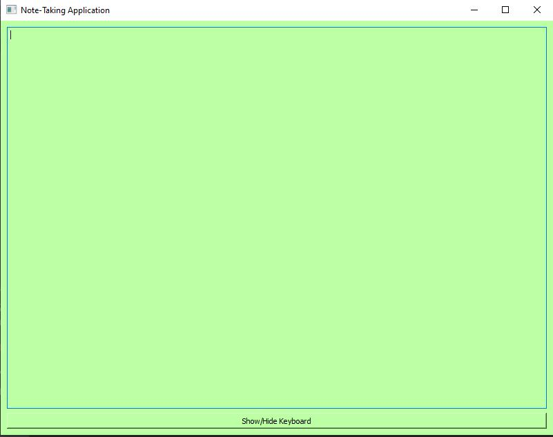
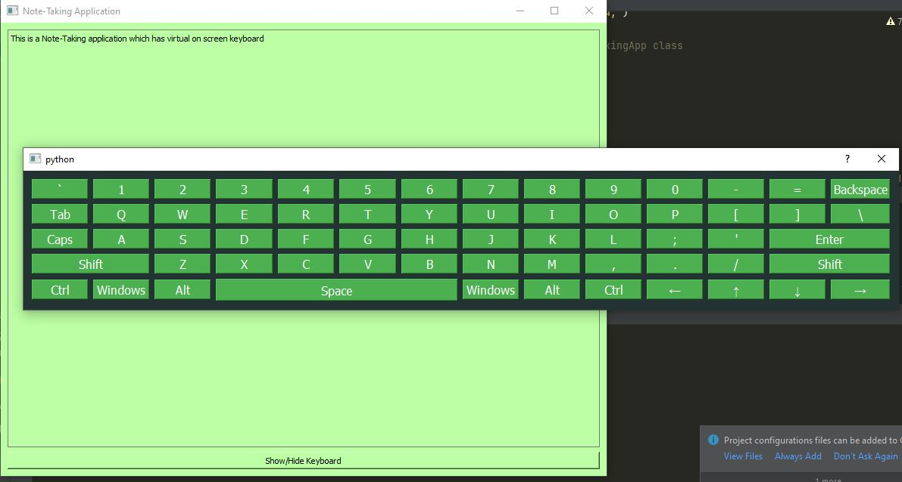

# Virtual Keyboard and Note Taking App

This repository contains a virtual on-screen keyboard module and a basic note-taking application that utilizes the virtual keyboard.

## Overview

The `Key_board.py` file provides a module for a virtual on-screen keyboard, which can be integrated into various applications that require user input.

The `my_note_taking.py` file is a simple note-taking application that utilizes the virtual keyboard module for text input.

## Screenshots

### Note Taking Application


### Virtual Keyboard


## Usage

### Virtual Keyboard

To use the virtual keyboard in your application, follow these steps:

1. Import `Key_board.py` into your project.
2. Create an instance of the `Keyboard` class.
3. Use the virtual keyboard in your application.

Here's a code snippet demonstrating how to use the virtual keyboard:

```python
from Key_board import Keyboard
from PyQt5.QtWidgets import QApplication, QTextEdit

app = QApplication([])
text_edit = QTextEdit()
keyboard = Keyboard(text_edit)
text_edit.show()
app.exec_()
